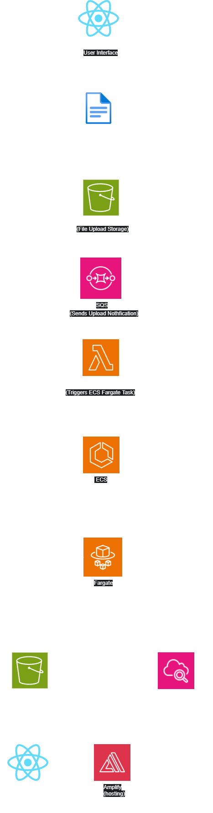

# Serverless File Processing System  
A secure, scalable, serverless system to upload Word documents, convert them to PDF, and return downloadable links via a React front end.

## Table of Contents  
1. Introduction  
2. Features  
3. Architecture Overview  
4. Architecture Diagram  
5. Technologies Used  
6. Prerequisites  
7. Setup & Deployment  
8. Usage  
9. Future Enhancements  

## Introduction  
The **Serverless File Processing System** enables users to securely upload Word documents, automatically converts them to PDF using ECS Fargate containers, and delivers a downloadable link via a React interface. The system is event-driven, serverless, and optimized for scalability and cost-effectiveness.

## Features  
- **File Upload via React**: Users upload Word documents directly from the web app.  
- **Automated File Processing**: Triggered when a file is uploaded to an S3 bucket.  
- **Serverless Event Handling**: Uses AWS Lambda to process SQS events and start ECS tasks.  
- **Containerized Conversion**: Converts Word documents to PDF inside Docker containers on ECS Fargate.  
- **Download via Pre-signed URL**: React interface fetches a downloadable PDF link.  
- **Secure and Scalable**: IAM-based access, encrypted storage, and event-based execution.  
- **Observability**: Logs and metrics captured in Amazon CloudWatch.

## Architecture Overview  
1. The user uploads a Word document using the **React** front end.  
2. The file is stored in an **S3 bucket** (input storage).  
3. S3 sends a notification to an **SQS queue**.  
4. An **AWS Lambda function** consumes the SQS message and starts an **ECS Fargate** task.  
5. The Fargate task:  
   - Downloads the Word file from S3  
   - Converts the file to PDF  
   - Uploads the PDF back to a different S3 bucket (output storage)  
6. A **pre-signed URL** is generated for downloading the PDF.  
7. The React front end displays the link for downloading the converted file.  
8. All job events and logs are captured in **Amazon CloudWatch**.

## Architecture Diagram  

## Technologies Used  
- **React** – Frontend interface for uploading and downloading files  
- **Amazon S3** – Stores original and converted files  
- **Amazon SQS** – Triggers backend processing when new uploads occur  
- **AWS Lambda** – Listens to SQS and starts ECS Fargate tasks  
- **Amazon ECS Fargate** – Runs Docker containers for document conversion  
- **Amazon CloudWatch** – Monitors job status and logs  
- **AWS IAM** – Access control and secure execution  
- **Python** – Used in the Lambda function and ECS task container

## Prerequisites  
- **AWS Account** with S3, ECS, SQS, Lambda, and CloudWatch enabled  
- **AWS CLI** installed and configured  
- **Docker** for local container testing  
- **React app** configured to interact with your API and download URLs  

## Usage
- **Upload via React**: Users upload `.docx` files through the React front end using a pre-signed S3 URL.
- **S3 Trigger**: Uploaded files trigger an S3 event notification to SQS.
- **Lambda Processing**: Lambda consumes the SQS message and triggers an ECS Fargate task.
- **Fargate Task Execution**:
  - Downloads the Word file from S3
  - Converts the document to PDF
  - Uploads the PDF to an output S3 bucket
- **Download via React**: A pre-signed URL is generated for the PDF, and React fetches and displays it for secure user download.

## Future Enhancements
- **Multi-format Conversion**: Add support for PowerPoint, Excel, and image files.
- **Progress Feedback**: Display real-time status updates in the front end.
- **Batch Uploads**: Allow uploading and converting multiple files at once.
- **Authentication Integration**: Secure uploads/downloads with Cognito or other auth providers.
